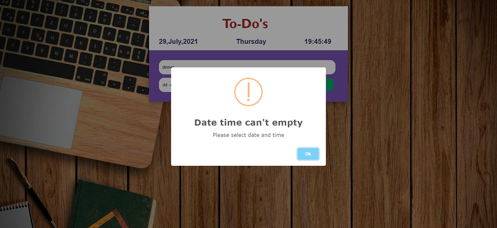

# To-Do-List-JS

#### I used HTML,CSS,JS to make this project.

### github page link :  https://sachinprajapati8604.github.io/To-Do-List-JS/
 

### Netlify Link : https://sptodos.netlify.app/

### Features

*add a task and pick date & time to complete the task.
*you will get successfull alert for add a task.
*a better visualisation for list items.
*You can add multiple items.
*Live Date and Time visualisation.
*countdown time for every task you will add.
*automatic color change <b> progress bar</b> .
*date and time funtions to visualize .
*you will get alert when task end.
*You can remove the list items.

### Others 

*I added some edge cases.
*You can't add empty task to list.
*You have to fill both input and date time.
*You can't pick the past date and time if you do this it give you alert like "please pick a future date time".
*I have added <b>Enter Key</b> funtionality.
*I have added media query for responsiveness.
*I have added reset funtionlity of input and date time after a successfull task added to list.

### Snapshot 

* Main page Interface

* fill date and time 

* alert for successfull

* ui after added task

* Time over when task has been completed 

* Mobile view 

#### Some edge cases snapshot

* If you will try to add without fill 

* When date and time is empty 

* When you select past date time  

